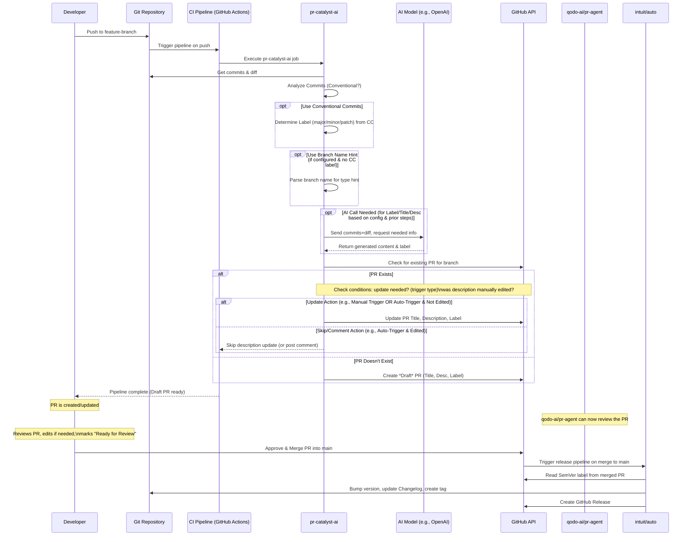

# pr-catalyst-ai

[](https://github.com/alborworld/pr-catalyst-ai/actions)
[](LICENSE)
[](https://github.com/alborworld/pr-catalyst-ai/releases)
<!-- Add other relevant badges: npm version, PyPI version, etc. if applicable -->

**AI-powered assistant to automatically create and manage draft Pull Requests with SemVer labels, designed to work seamlessly with [qodo-ai/pr-agent](https://github.com/qodo-ai/pr-agent) and [intuit/auto](https://github.com/intuit/auto).**

Stop wasting time manually creating PRs and figuring out SemVer bumps. `pr-catalyst-ai` watches your feature branches and automatically creates draft PRs with appropriate labels, letting you focus on coding while [qodo-ai/pr-agent](https://github.com/qodo-ai/pr-agent) handles PR review and [intuit/auto](https://github.com/intuit/auto) manages releases.

---

## The Problem

*   Manually creating PRs and determining SemVer labels can be tedious and inconsistent.
*   Different team members might use different PR formats or SemVer labeling approaches.
*   Inconsistent PR creation and labeling makes release management harder.

## The Solution

`pr-catalyst-ai` integrates into your CI/CD pipeline to:

1.  **Watch Feature Branches:** Automatically creates draft PRs when you push to a feature branch.
2.  **Analyze Changes:** Examines commit messages (prioritizing Conventional Commits) and branch names.
3.  **Leverage AI:** Uses AI to generate initial PR content and suggest SemVer labels.
4.  **Create Draft PRs:** Automatically creates or updates draft PRs with appropriate labels.
5.  **Respect Manual Edits:** By default, avoids overwriting manually edited PR content.
6.  **Prepare for Review:** Creates PRs ready for review by [qodo-ai/pr-agent](https://github.com/qodo-ai/pr-agent).
7.  **Support Releases:** Ensures PRs have proper SemVer labels for [intuit/auto](https://github.com/intuit/auto) to manage releases.

**`pr-catalyst-ai` is part of a toolchain.** It creates PRs, [qodo-ai/pr-agent](https://github.com/qodo-ai/pr-agent) reviews them, and [intuit/auto](https://github.com/intuit/auto) handles releases.

---

## ✨ Features

*   **Automatic PR Creation:** Creates draft PRs when you push to feature branches.
*   **Intelligent SemVer Labeling:** Suggests `major`, `minor`, or `patch` labels using:
    *   **Conventional Commits First:** Reliably determines the bump if [Conventional Commits](https://www.conventionalcommits.org/) are used.
    *   **Branch Name Hints:** Can infer `minor`/`patch` from branch prefixes (e.g., `feat/`, `fix/`).
    *   **AI Inference:** Falls back to AI analysis if needed.
*   **Configurable Updates:** Control when and how PRs are updated:
    *   **On Push:** Update PR with each push (default)
    *   **On Ready:** Update when marked "Ready for Review"
    *   **Manual:** Update only when triggered manually
*   **Respects Manual Edits:** Avoids overwriting manually edited content during automatic updates.
*   **GitHub Integration:** Works seamlessly with GitHub Actions.
*   **Simple Configuration:** Tailor behavior via a YAML file.

---

## ⚙️ How It Works



## 🚀 Getting Started (GitHub Actions)

### Prerequisites
1. A GitHub repository.
2. GitHub Actions enabled for your repository.
3. An API Key for your chosen LLM provider (e.g., OpenAI).
4. A GitHub Token:
  - The default secrets.GITHUB_TOKEN usually works for actions within the same repository.
  - You might need a Personal Access Token (PAT) with repo scope if your action needs broader permissions (ensure it's stored securely as a secret).

### Setup

1. Add Workflow File: Create a workflow file in your repository, for example, `.github/workflows/ai-pilot.yml`:
```
name: AI Release Pilot

on:
  push:
    branches-ignore: # Ignore pushes to main/master/develop etc.
      - main
      # - master # Uncomment if you use master
      # - develop # Uncomment if you use develop

jobs:
  draft_pr:
    runs-on: ubuntu-latest
    # Limit concurrency to avoid race conditions on the same branch
    concurrency:
      group: ${{ github.workflow }}-${{ github.ref }}
      cancel-in-progress: true
    # Grant permissions for the GITHUB_TOKEN to manage PRs and labels
    permissions:
      pull-requests: write
      contents: read # Needed to read repo contents for diff/log

    steps:
      - name: Checkout code
        uses: actions/checkout@v4
        with:
          fetch-depth: 0 # Fetch all history for accurate diff/log

      - name: Run AI Release Pilot
        uses: alborworld/pr-catalyst-ai@v1 # Use the correct version tag
        with:
          # Required: Your LLM API Key (use GitHub secrets)
          llm_api_key: ${{ secrets.OPENAI_API_KEY }} # Or your specific LLM key secret

          # Optional: Specify the base branch if not 'main'
          # base_branch: 'develop'

          # Optional: GitHub Token (defaults to secrets.GITHUB_TOKEN)
          # github_token: ${{ secrets.YOUR_PAT }}

          # Optional: Specify LLM provider if needed (defaults might apply)
          # llm_provider: 'openai' # Example

          # Add other 'with' options here as needed based on action inputs
```
  - Important: Replace `alborworld/pr-catalyst-ai@v1` with the correct path and version tag for your action once published. Adjust branches-ignore for your workflow.
2. Configure Secrets: Add your LLM API key as a repository secret (e.g., OPENAI_API_KEY):
  - Go to your repository > Settings > Secrets and variables > Actions > New repository secret.
3. (Optional) Add Configuration File: Create a `.pr-catalyst-ai.yml` file in the root of your repository to customize behavior (see Configuration below).

### 💡 Usage

1. **Push Code**: Create a feature branch and push your commits as usual.
    ```
    git checkout -b feat/add-user-profile
    # Make changes, commit code...
    git push origin feat/add-user-profile
    ```
2. **Automatic Draft PR:** The GitHub Action will trigger. pr-catalyst-ai analyzes the changes and creates (or updates) a draft Pull Request, populating the title, description, and SemVer label based on your configuration.
3. **Review & Refine:** Check the draft PR. Edit the title, description, or label as needed. The AI provides a starting point, but your review is crucial, especially for the SemVer label! You can optionally use [qodo-ai/pr-agent](https://github.com/qodo-ai/pr-agent) to automatically review the PR.
4. **Mark Ready:** When satisfied, mark the PR as "Ready for Review". (Depending on your configuration, this might trigger another AI update if manual edits weren't made).
5. **Merge:** Follow your normal code review and approval process, then merge the PR into your base branch (main, develop, etc.).
6. **Automated Release:** Your separate semantic release tool (e.g., [intuit/auto](https://github.com/intuit/auto)) triggers on the merge, reads the SemVer label applied by `pr-catalyst-ai` (and confirmed by you!), bumps the version, updates the changelog, tags the release, and creates a GitHub/GitLab Release.

For a detailed visualization of this workflow, see the sequence diagram in the [How It Works](#-how-it-works) section above.

### 🔧 Configuration

Customize `pr-catalyst-ai` behavior via `.pr-catalyst-ai.yml`:

```yaml
# --- Update Strategy ---
update_strategy:
  # When to update the PR
  trigger: 'on_push'  # Options: 'on_push', 'on_ready', 'manual'
  
  # How to handle updates
  behavior:
    # If PR description was manually edited
    on_manual_edit: 'skip'  # Options: 'skip', 'comment', 'update'
    
    # What to update
    update_fields:
      - 'title'      # Update PR title
      - 'description' # Update PR description
      - 'label'      # Update SemVer label

# --- SemVer Labeling ---
semver_label_mode: 'automatic'  # Options: 'automatic', 'conventional_commits_only', 'disabled'
parse_branch_name: true
branch_name_pattern: '^(?<type>feat|fix|chore|refactor|perf|test|ci|docs|build|style)(?:\((?<scope>[^/]+)\))?/(?<description>.*)$'

# --- AI Configuration ---
llm_provider: 'openai'
llm_model: 'gpt-3.5-turbo'
```
**Rationale**:
- Simplified configuration options
- Clear update strategy options
- Focused on essential settings

### 🙌 Contributing

Contributions are welcome! Please read our [CONTRIBUTING.md](CONTRIBUTING.md) guidelines for details on how to submit pull requests, report issues, and suggest features.

We expect participants to adhere to our [CODE_OF_CONDUCT.md](CODE_OF_CONDUCT.md).

### 📜 License

This project is licensed under the [MIT license](LICENSE).
